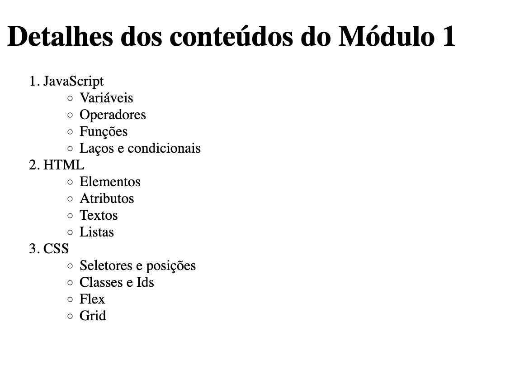

# Exercício 2

Crie um arquivo exercicio1.html, e neste arquivo, crie a estrutura de uma página HTML5, com head e body. Adicione o título **Exercício 2**, e crie uma página seguindo o exemplo abaixo:

