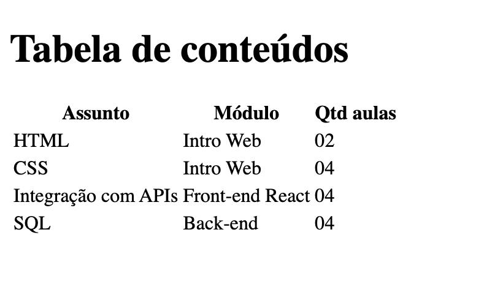

# Exercício 3

Crie um arquivo exercicio3.html, e neste arquivo, crie a estrutura de uma página HTML5, com head e body. Adicione o título **Exercício 3**, e crie uma página seguindo o exemplo abaixo:

